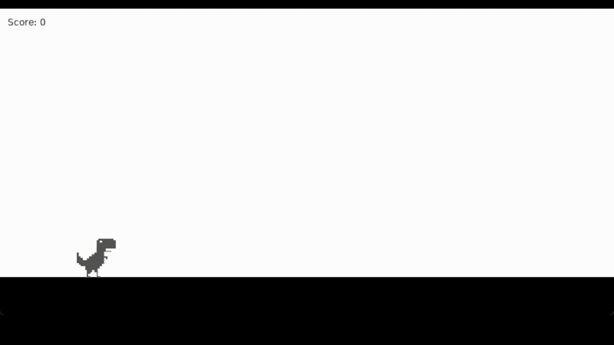
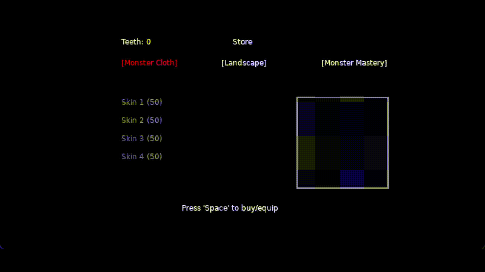
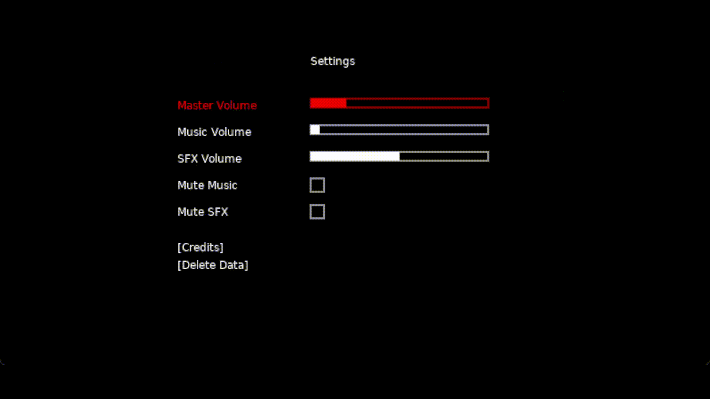

# Monster Dash

Welcome to Monster Dash, a Lua script project where a monster jumps over obstacles with the added excitement of a game store featuring skins and upgrades!

This project was created as part of a university course. It was developed by [Enur](https://github.com/EnurDev) and [Martin](https://github.com/MStoyadinov)

## Table of Contents

- [Love2D & Lua Script](#love2d--lua-script)
- [Introduction](#introduction)
- [Features](#features)
- [How to Play](#how-to-play)
- [Gameplay](#gameplay)
- [Store](#store)
- [Settings](#settings)

## Love2D & Lua Script

Monster Dash is a casual game written in Lua script, leveraging the power of LOVE2D (https://www.love2d.org/). LOVE2D provides a user-friendly framework for game development, allowing creators to bring their ideas to life with ease.

## Introduction

Monster Dash is a fun and casual game created in Lua script, where players control a monster to navigate through obstacles by jumping. The game features a game store where players can unlock new skins and upgrades to enhance their gaming experience.

## Features

- Simple and intuitive gameplay.
- Challenging obstacles to overcome.
- Score tracking to keep track of your progress.
- Game store with skins and upgrades.

# How to Play

Follow these simple steps to start playing Monster Dash:

1. **Download the Game:**
   - Click [here](https://github.com/EnurDev/Monster_Dash_Project/releases/download/Launch-1.0.0/MonsterDash.zip) to download the game files as a ZIP archive.

2. **Unzip the Files:**
   - Locate the downloaded ZIP file on your computer.
   - Right-click on the file and select "Extract All" to unzip the contents.

3. **Navigate to the Game Directory:**
   - Open the extracted folder to find the game files.

4. **Start the Game:**
   - Look for a file named `Monster Dash.exe` executable file.
   - Double-click on the executable file to start the game.

5. **Play the Game:**
   - Use the provided controls to make the monster jump over obstacles.
   - Collect points to unlock new skins and upgrades from the in-game store.
   - Aim for the highest score and enjoy the Monster Dash experience!

### Gameplay

Dive into the world of Monster Dash! Dodge obstacles, control your monster with precision, and collect points to unlock exciting skins and upgrades. Watch the gameplay in action:

### Store

Unlock new skins and upgrades in the in-game store:

### Settings

Customize your gaming experience in the settings menu:

### For an immersive gaming experience, join Monster Dash today!
